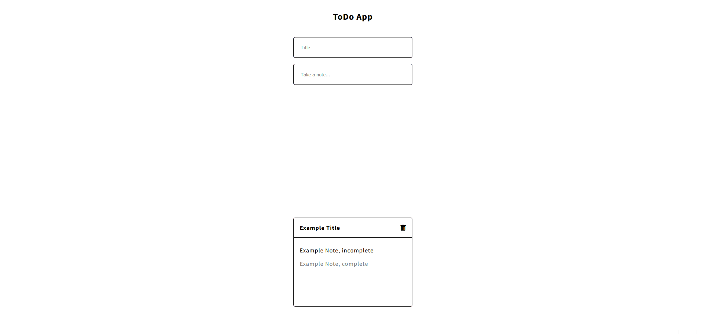

# ToDo App
A Vanilla JavaScript ToDo App

## Features
- Add Note with Title and Todos
- Delete Note
- Local Storage
- Responsive

## Usage

1. Add Title
2. Add a todo and press Enter to clear the input field for the next todo
3. Click anywhere outside of the input boxes to add the note to your list

## Demo

